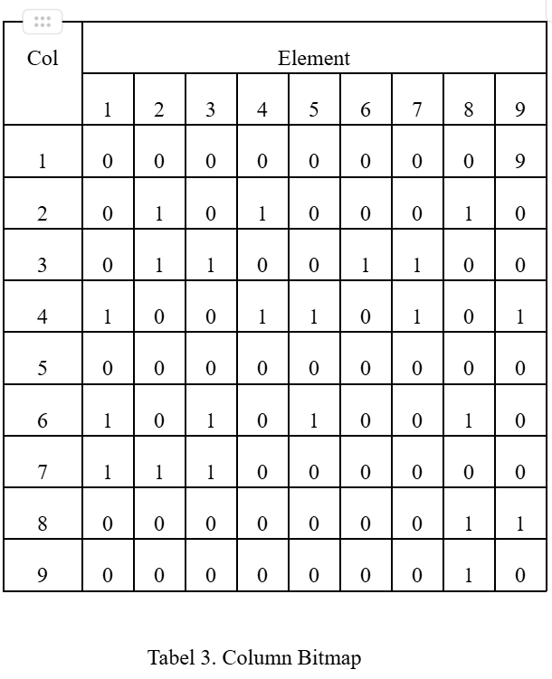
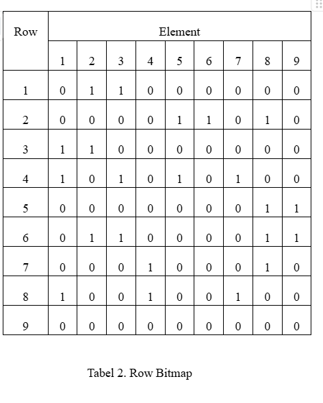

[![Contributors][contributors-shield]][contributors-url]

<!-- PROJECT LOGO -->
 

  

  <h3 align="center">Sudoku Solver</h3>

<!-- TABLE OF CONTENTS -->

  
Table of Contents

  <ol>
    <li>
      <a href="#about-the-project">About The Project</a>
      <ul>
        <li><a href="#objectives">Objectives</a></li>
      </ul>
    </li>
    <li><a href="#fundamental">Fundamentals</a></li>
    <li><a href="#conclusion">Conclusion</a></li>
    <li><a href="#contributing">Contributing</a></li>
  </ol>

<!-- ABOUT THE PROJECT -->
## About The Project

Proyek Sudoku Solver ini adalah solusi berbasis perangkat keras untuk menyelesaikan Sudoku menggunakan VHDL dan FPGA. Sistem ini menggunakan pendekatan Finite State Machine untuk mengelola seluruh proses penyelesaian, mulai dari mengidentifikasi cell kosong hingga melakukan tebakan yang valid dan mundur jika diperlukan. Input yang diberikan berupa grid, dan sistem menggunakan representasi bitmap untuk melacak validitas setiap angka yang mungkin pada setiap baris, kolom, dan blok. Dengan algoritma pencarian yang efisien, sistem ini menyelesaikan langkah demi langkah, memperbarui grid hingga solusi ditemukan. Proyek ini menunjukkan penerapan praktis dari FSM dalam penyelesaian, sekaligus menunjukkan bagaimana FPGA dapat dimanfaatkan untuk masalah komputasi. Simulasi dilakukan menggunakan ModelSim menunjukkan bahwa puzzle berhasil diselesaikan dengan setiap langkah terlihat jelas di waveform, dan sistem bertransisi antar state untuk penyelesaiannya. 

(<a href="#readme-top">back to top</a>)

<!-- GETTING STARTED -->
## Objectives
- Menerapkan Algoritma Penyelesaian Sudoku pada FPGA dengan VHDL
- Mengoptimalkan Penggunaan Finite State Machine dengan backtracking.
- Mempercepat Proses Penyelesaian Sudoku dengan Hardware: 

(<a href="#readme-top">back to top</a>)
  

### Built With
- VS Code
- MODELSIM
- Intel Quartus Pro

  
(<a href="#readme-top">back to top</a>)

<!-- USAGE EXAMPLES -->
## Fundamental

Proyek ini mengimplementasikan algoritma backtracking untuk mengisi sel-sel kosong dalam teka-teki Sudoku dengan angka valid, sambil memeriksa kendala-kendala yang ada. Untuk meningkatkan efisiensi, digunakan bitmap untuk memetakan angka-angka yang sudah ada pada baris, kolom, dan blok tertentu. Bitmap baris, kolom, dan blok digunakan untuk memvalidasi angka yang bisa ditempatkan pada setiap sel kosong dengan memeriksa apakah angka tersebut sudah ada pada peta yang relevan. Dengan cara ini, sistem dapat dengan cepat menentukan angka yang valid untuk dimasukkan, sekaligus meminimalkan pencarian yang tidak perlu. Input buffer dari pengguna memungkinkan pemilihan angka yang tepat berdasarkan peta-peta tersebut. Berikut adalah gambarannya:

| Sudoku               |
|----------------------|
|  |
| Column               |
|        |
| Row               |
|              |

(<a href="#readme-top">back to top</a>)

## Conclusion
Proyek Sudoku Solver mengimplementasikan algoritma backtracking untuk menyelesaikan puzzle Sudoku dengan menggunakan bitmap untuk efisiensi pengecekan validitas angka di baris, kolom, dan blok. Sistem ini dapat secara otomatis mencari dan mengisi cell kosong, serta melakukan backtrack saat menemui kendala. Dengan pendekatan berbasis state machine (FSM).

(<a href="#readme-top">back to top</a>)

### Contributors:

 

**Wilman Saragih Sitio		2306161776  
Ammar Fattan R			2306266981  
Nelson Laurensius			2306161845  
Aisya Rivelia Azzahra		2306161864**

(<a href="#readme-top">back to top</a>)

Project Link: [FInal Project PA-19](https://github.com/nlsnlaurensius/Proyek-Akhir-PSD-PA19)

(<a href="#readme-top">back to top</a>)

[contributors-shield]: https://img.shields.io/github/contributors/nlsnlaurensius/Proyek-Akhir-PSD-PA19.svg?style=for-the-badge 
[contributors-url]: https://github.com/nlsnlaurensius/Proyek-Akhir-PSD-PA19/graphs/contributors
